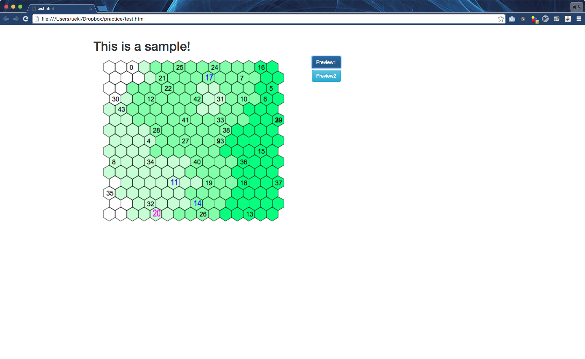
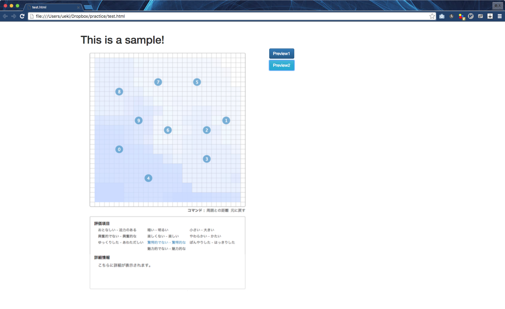

# ミーティングアジェンダ

- 本取り組みの目的
  - 研究室で使用されているシステムが引き継ぎを重ねて使いにくいものになっているので，その改善．
  - 後期からの卒研に向けて，前期にシステム開発のノウハウを身につける．
- システムの概要
  - 用途
  - 課題
  - 理想
- Githubガイダンス
  - 用途 
  - 簡単な使い方
- Slackガイダンス
  - 用途
  - 簡単な使い方
- ドットインストールガイダンス
  - 用途
  - 簡単な使い方

# 今日のタスク

- Githubアカウント作成
  - Invite as a member 
- Slackアカウント作成
  - Invite as a member
- ドットインストールアカウント作成

# 次回までのタスク

- 作るもの

|preview1|preview2|
|---|---|
|||

