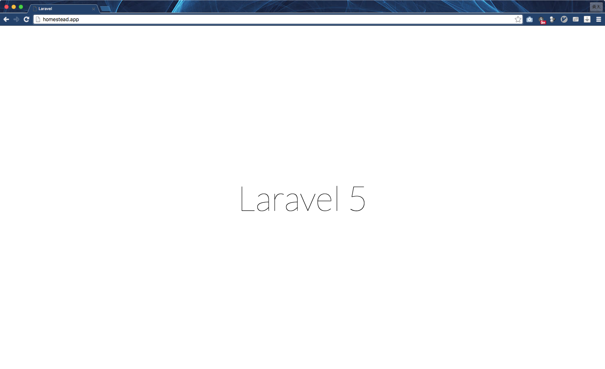

# ミーティングアジェンダ

- 先週のタスク確認
- 仮想マシン(VM: Virtual Machine)について
  - [[ThinkIT] 第1回：仮想マシンとサーバ仮想化について (1/3)](https://thinkit.co.jp/free/tech/26/1/1.html)
  - コンピュータ上で別のOSを動かす技術
- Virtual Boxについて
  - VM を動かすためのツール
- Vagrantについて
  - [開発環境の構築・共有を簡単にするVagrant入門 | Think IT（シンクイット）](https://thinkit.co.jp/story/2015/03/19/5740)
  - 開発環境の構築と共有を簡単に行うためのツール
- フレームワークについて
  - [WEBフレームワークとは？最強おすすめフレームワーク5選【Java/Ruby/PHP/JS/CSS】 | 侍エンジニア塾ブログ | プログラミング入門者向け学習情報サイト](http://www.sejuku.net/blog/30)
  - 「枠組み」という意味があり，開発を行う際に，頻繁に必要とされる基礎的な機能をまとめて提供してくれるもの．
- Laravel5について
  - PHPのフレームワークの1つ．
  - 現在世界的に主流なPHPフレームワーク
    - [【2016年版】PHPフレームワーク人気比較 | TechStars Blog](https://techstars.jp/blog/framework2/)
  - 詳細は次週話します．

# 今週のタスク

- Laravel5での開発環境の構築
  - Vagrantのインストール
    - 自分で調べて
    - 多分どこかのタイミングでVirtual Boxもインストールします．
  - Laravel5の環境構築
    - [Laravel homesteadを利用したLaravel 5 ローカル開発環境の構築 | hrendoh's memo](http://blog.hrendoh.com/setting-up-laravel-local-dev-environment-with-homestead/)
  - 以下の画面が表示されたら完了
  - 

